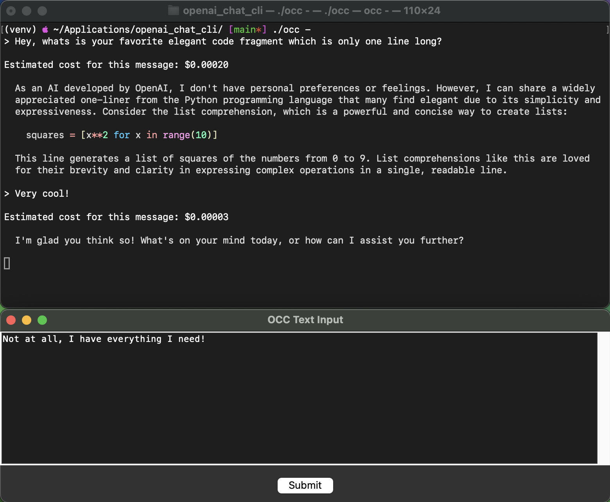

# openai_chat_cli
Chat application in your terminal, built with OpenAI and Python 3



## Features

- Conversational history saved in Markdown files
- Multiple OpenAI model support (selectable at runtime)
- **Attach files or code snippets to your prompt using `\att <filename> [from:to]` anywhere in your message**
  - Attach whole files or specify a line range (e.g., `\att script.py 10:20`)
- Clean Tkinter-based text input interface

## Setup

1. Install <code>tkinter</code> and <code>openai</code> pip packages (see requirements.txt).
2. Set the <code>OPENAI_API_KEY</code> environment variable.
3. Set _CONFIG_PATH_ in the <code>occ</code> script (default is source folder <code>./config.json</code>).
4. Customize <code>./config.json</code> (e.g. set available models).

## Usage

- Start the app from your terminal. You can supply a conversation ID or let the script auto-generate one.
- Enter your prompt in the window and submit.
- **To include a file’s contents in your prompt, type**  
  ```  
  \att path/to/file.txt [from:to]
  ```
  anywhere in your message.  
   - `from:to` is optional (line numbers, inclusive, 1-based).  
   - You can use multiple `\att ...` commands; each will get replaced with the content of the given file or line range, embedded in your message.
- Example prompts:
  ```
  Please review this code:
  \att myscript.py 20:35

  And also look at my configuration:
  \att config.json
  ```
- The file content and an indicator line are inserted inline in your message, before being sent to the model.